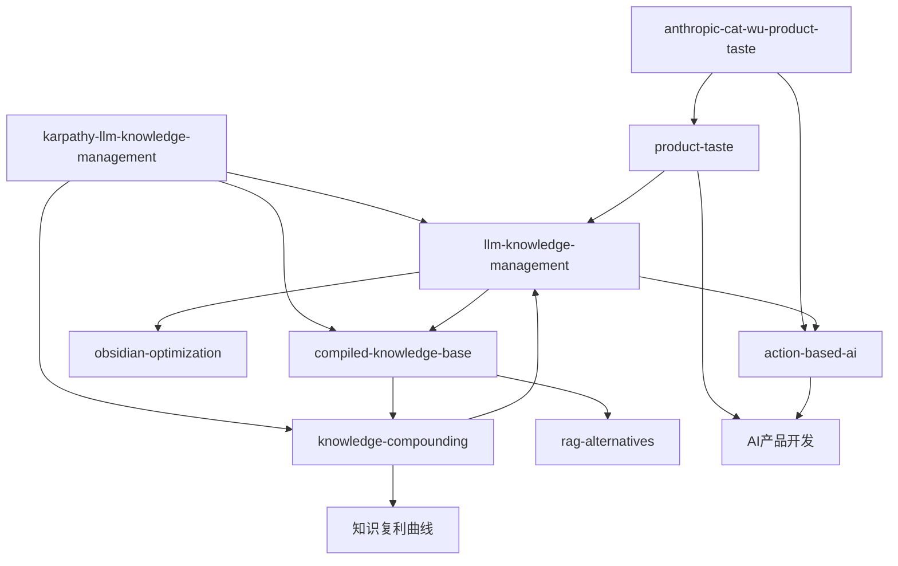

# LLM知识管理Wiki

这是一个基于Andrej Karpathy**LLM编译型知识库**模式的个人wiki，由Claude Code自动维护。wiki将原始素材编译为结构化、互链的知识网络，实现知识复利增长。

## 当前焦点：LLM驱动的知识管理革命

最近摄取的源文件[[karpathy-llm-knowledge-management]]揭示了知识管理范式的根本转变：

```
传统：人读→人写笔记→人建链接→人维护
现代：人输入素材→LLM编译→人提问→LLM维护
```

### 核心概念网络



### 关键洞察

1. **LLM作为编译器**：原始素材(`raw/`)经LLM处理生成结构化知识(`wiki/`)
2. **自动交叉链接**：LLM维护页面间的`[[wikilinks]]`关系网
3. **知识复利**：每次查询的有价值结果可写回wiki，知识持续增长
4. **小规模高效**：几十篇文章时，简单索引足够，无需复杂RAG

### 扩展主题：AI产品开发前沿

最新摄取的源文件[[anthropic-cat-wu-product-taste]]揭示了AI时代产品开发的新范式：

- **产品品味崛起**：代码成本下降，[[product-taste]]成为新核心竞争力
- **行动派AI**：从聊天到[[action-based-ai]]的范式转移
- **极致敏捷**：发布周期从6个月压缩到1天
- **工具策略**：[[claude-code]] for代码，Co-work for非代码的清晰分界

### 新兴主题：AI Agent框架分化

最新摄取的源文件[[ai-agent-comparisons-2026]]揭示了2026年AI Agent框架的三足鼎立格局：

- **连接广度优先**：[[ai-agent-frameworks|OpenClaw]] - 最大社区，50+消息渠道全覆盖
- **认知深度优先**：[[ai-agent-frameworks|Hermes Agent]] - 自我进化，四层记忆系统
- **易用性优先**：[[ai-agent-frameworks|Claude Cowork]] - 零代码门槛，桌面集成

关键洞察：记忆系统差距最大，自我进化能力成为新分水岭，安全模型从应用级检查演进到操作系统级隔离。

### 新兴主题：AI安全与可解释性

最新摄取的源文件[[anthropic-interpretability]]揭示了Anthropic在AI可解释性方面的系统性工作：

- **四年研究路径**：从2022年"神经元叠加现象"到2026年"AI审计"的完整演进
- **核心突破**：特征分解、电路追踪、人格向量、AI自省、助手轴
- **根本局限**：特征不可靠、替代模型精度不足、规模瓶颈、可解释≠可控
- **战略价值**：学术价值9分，实用价值4分，战略意义9分

关键洞察：可解释性研究是AI领域的核物理基础研究——不直接生产武器，但没有它，当需要控制时我们将两眼一抹黑。在一个所有人都在踩油门的赛道上，得有一家公司研究刹车怎么造。

## 探索路径

### 从概念开始
- [[llm-knowledge-management]] - LLM作为核心维护者的新范式
- [[compiled-knowledge-base]] - 编译型知识库架构
- [[knowledge-compounding]] - 知识复利效应机制
- [[product-taste]] - 代码廉价化时代的新核心竞争力
- [[action-based-ai]] - 从聊天到行动的范式转移
- [[ai-agent-frameworks]] - 2026年AI Agent框架三足鼎立：OpenClaw（连接广度）、Hermes（认知深度）、Claude Cowork（易用性）
- [[mechanistic-interpretability]] - 机制可解释性研究：从神经元叠加到AI审计，理解AI决策过程的关键工具
- [[obsidian-rebuild-experience]] - 个人实践：Karpathy方法改造Obsidian的体验与认知转变
- [[knowledge-compilation-workflow]] - 三层目录结构的完整知识编译工作流

### 进阶概念
- [[knowledge-health-check]] - 知识库健康检查系统设计
- [[incremental-compilation]] - 增量编译机制与优化
- [[knowledge-engineering]] - 将工程原则应用于知识管理

### 查看源文件
- [[karpathy-llm-knowledge-management]] - LLM知识管理实践案例
- [[anthropic-cat-wu-product-taste]] - AI产品开发前沿洞察
- [[karpathy-obsidian-rebuild]] - 个人实践：一小时重建Obsidian知识库的体验与认知转变
- [[karpathy-knowledge-workflow-guide]] - 完整知识编译工作流指南：三层目录结构、健康检查、增量编译
- [[ai-agent-comparisons-2026]] - 2026年AI Agent框架深度对比：OpenClaw、Hermes、Claude Cowork等7种方案
- [[anthropic-interpretability]] - Anthropic在AI可解释性方面的系统性工作：从神经元叠加到AI审计的四年研究路径

### 浏览索引
- [[index]] - 所有页面的分类目录

## 工作流程

1. **摄取**：将新素材放入`raw/`，运行`/ingest`
2. **查询**：基于wiki上下文提问，LLM综合回答
3. **维护**：定期运行`/lint`检查知识库健康度
4. **扩展**：使用`/import-readwise`等技能导入外部内容

## 实时状态

- **源文件**：6篇（LLM知识管理 + AI产品开发 + 个人实践验证 + 工作流指南 + AI Agent框架对比 + AI可解释性研究）
- **概念页**：14个（LLM知识管理、编译型知识库、知识复利、产品品味、行动派AI、Obsidian优化、RAG替代方案、AI Agent框架、Obsidian重建体验、知识编译工作流、健康检查、增量编译、知识工程、机制可解释性）
- **总页面**：23个（含home、index、log、6源摘要、14概念页）
- **最后更新**：2026-05-03（深度消化4个关键源摘要页面）

> 提示：在右侧终端输入`claude`开始与wiki交互，或使用`/ingest`添加更多源文件。
