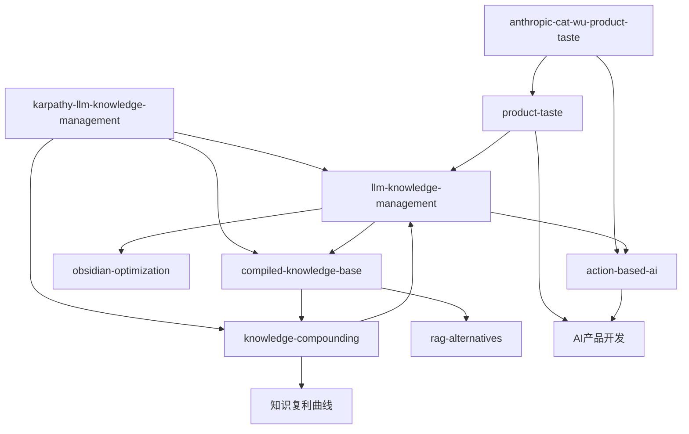

# LLM知识管理Wiki

这是一个基于Andrej Karpathy**LLM编译型知识库**模式的个人wiki，由Claude Code自动维护。wiki将原始素材编译为结构化、互链的知识网络，实现知识复利增长。

## 当前焦点：LLM驱动的知识管理革命

最近摄取的源文件[[karpathy-llm-knowledge-management]]揭示了知识管理范式的根本转变：

```
传统：人读→人写笔记→人建链接→人维护
现代：人输入素材→LLM编译→人提问→LLM维护
```

### 核心概念网络



### 关键洞察

1. **LLM作为编译器**：原始素材(`raw/`)经LLM处理生成结构化知识(`wiki/`)
2. **自动交叉链接**：LLM维护页面间的`[[wikilinks]]`关系网
3. **知识复利**：每次查询的有价值结果可写回wiki，知识持续增长
4. **小规模高效**：几十篇文章时，简单索引足够，无需复杂RAG

### 扩展主题：AI产品开发前沿

最新摄取的源文件[[anthropic-cat-wu-product-taste]]揭示了AI时代产品开发的新范式：

- **产品品味崛起**：代码成本下降，[[product-taste]]成为新核心竞争力
- **行动派AI**：从聊天到[[action-based-ai]]的范式转移
- **极致敏捷**：发布周期从6个月压缩到1天
- **工具策略**：[[claude-code]] for代码，Co-work for非代码的清晰分界

## 探索路径

### 从概念开始
- [[llm-knowledge-management]] - LLM作为核心维护者的新范式
- [[compiled-knowledge-base]] - 编译型知识库架构
- [[knowledge-compounding]] - 知识复利效应机制
- [[product-taste]] - 代码廉价化时代的新核心竞争力
- [[action-based-ai]] - 从聊天到行动的范式转移

### 查看源文件
- [[karpathy-llm-knowledge-management]] - LLM知识管理实践案例
- [[anthropic-cat-wu-product-taste]] - AI产品开发前沿洞察

### 浏览索引
- [[index]] - 所有页面的分类目录

## 工作流程

1. **摄取**：将新素材放入`raw/`，运行`/ingest`
2. **查询**：基于wiki上下文提问，LLM综合回答
3. **维护**：定期运行`/lint`检查知识库健康度
4. **扩展**：使用`/import-readwise`等技能导入外部内容

## 实时状态

- **源文件**：2篇（LLM知识管理 + AI产品开发）
- **概念页**：5个（LLM知识管理、编译型知识库、知识复利、产品品味、行动派AI）
- **总页面**：9个（含home、index、log、2源摘要、5概念页）
- **最后更新**：2026-05-03（第二次ingest - AI产品开发）

> 提示：在右侧终端输入`claude`开始与wiki交互，或使用`/ingest`添加更多源文件。
