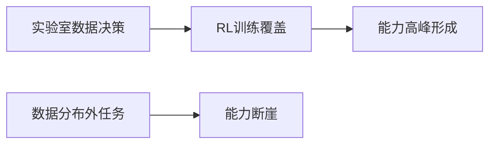

# Jagged Intelligence

**TL;DR**：Jagged Intelligence（锯齿状智能）描述了大语言模型能力高度不均匀的现象——在某些任务上强如专家，在另一些任务上弱得荒诞，能力曲线不是平滑上升，而是有高峰和断崖，这种现象与模型的训练数据分布和强化学习覆盖直接相关。

## 这是什么

Jagged Intelligence是理解当前LLM能力边界的关键框架。它不是简单的“模型在某些方面聪明，在某些方面笨”，而是能力分布呈现出极端的不连续性：

### 典型对比案例
- **高峰能力**：重构10万行代码、找到零日漏洞、解决复杂数学问题
- **断崖能力**：“去50米外洗车该走路还是开车”这种常识题上犯错

### 关键特征
1. **非单调性**：能力与任务难度不成正比，简单任务可能比复杂任务更难
2. **领域特异性**：能力集中在特定领域，跨领域表现可能骤降
3. **可预测性差**：人类直觉难以判断某个任务是否在模型能力高峰内
4. **边界陡峭**：微小任务变化可能导致表现从90%掉到10%

## 形成机制

### 强化学习（RL）覆盖决定能力高峰
Karpathy的核心判断：模型在某个领域的能力强度，主要取决于该领域是否被纳入强化学习训练循环：

#### 具体机制
1. **RL构造奖励信号**：在可验证任务（数学、代码、安全漏洞）上，可以构造明确的奖励函数
2. **大量试错训练**：模型在模拟环境中尝试、失败、获得奖励、优化行为
3. **能力内化**：通过RL训练，模型在该领域形成稳定的“能力回路”
4. **分布外惩罚**：RL未覆盖的领域，模型缺乏优化信号，表现随机

### 数据分布的隐形塑造
模型能力不仅取决于RL，还受预训练数据分布的隐形塑造：

- **国际象棋案例**：从GPT-3.5到GPT-4的国际象棋能力大幅提升，不是因为“模型整体变聪明”，而是因为OpenAI决定把大量国际象棋数据加入预训练（[[karpathy-interview-agentic-engineering]]）
- **领域偏差**：互联网上丰富的领域（编程、数学）形成数据富集，冷门领域数据稀疏
- **语言文化偏差**：英语内容主导的训练数据导致其他语言能力较弱

### "幽灵" vs "动物"框架
Karpathy提出用"幽灵"（ghost）而非"动物"（animal）来理解LLM的本质（[[karpathy-interview-agentic-engineering]]）：

- **动物智能**：来自进化、身体、环境互动、内在动机、好奇心、持续学习
- **LLM（幽灵）**：由人类文档、统计模式和奖励函数塑造的模拟实体，没有动物式情绪或内在动机

这个框架强调：不要笼统地问"AI聪不聪明"，要问它在哪些训练分布里强，哪些奖励信号塑造了它，在哪些任务上可能出现锯齿状断崖。模型行为来自统计模拟、上下文、工具、训练数据和奖励机制，而非动物式的情绪或动机。

### 可验证性作为分水岭
Karpathy的公式：
> **传统计算机容易自动化你能写进代码的东西；这一代LLM容易自动化你能验证的东西。**

**可验证任务的特点**：
1. **明确的对错标准**：数学题有正确答案，代码有测试用例
2. **自动评估可能**：系统可以自动判断输出质量
3. **奖励信号清晰**：可以构造数值化的奖励函数
4. **规模化训练**：可以生成大量训练样本

## 影响与后果

### 对使用者的挑战
#### 1. 期望管理困难
- 不能因为模型在代码上很强，就默认它在所有工程判断上都强
- 不能因为它犯了洗车题这种错误，就断定它整体没用

#### 2. 能力探索成本高
- 每个新领域都需要实验测试模型的实际能力
- 缺乏系统的能力评估框架

#### 3. 系统设计复杂化
- 需要将任务分解到模型能力高峰领域
- 在能力断崖处设置人工监督或回退机制

### 对创业和投资的影响
#### 机会窗口
- **蓝海领域**：寻找可验证但未被大模型实验室重点覆盖的领域
- **微调优势**：在特定领域构造自己的RL环境，建立护城河
- **混合系统**：将模型能力高峰与传统软件结合，创造新产品形态

#### 风险识别
- **技术风险**：依赖模型在能力断崖领域的表现
- **竞争风险**：大实验室可能随时将你的领域纳入RL覆盖
- **产品风险**：用户可能高估或低估模型的实际能力

### 对教育和学习的影响
#### 学习重点转移
- **减少**：机械记忆、低层执行细节、RL已覆盖的领域
- **增加**：系统理解、问题定义、质量判断、跨领域连接

#### 教育方法更新
- **能力映射**：帮助学生理解模型的能力分布图
- **混合教学**：在模型强项上利用AI辅助，在弱项上加强人工教学
- **验证思维**：培养构造验证环境和评估标准的能力

## 应对策略

### 能力探测框架
1. **任务分解**：将复杂任务拆解成原子任务
2. **能力测试**：对每个原子任务设计基准测试
3. **分布映射**：绘制任务在模型能力分布中的位置
4. **策略选择**：根据位置选择AI执行、人工执行或混合执行

### 系统设计原则
1. **高峰优先**：将核心功能放在模型能力高峰领域
2. **断崖防御**：在能力断崖处设置防护措施
3. **渐进暴露**：逐步增加模型的权限和责任
4. **持续监控**：跟踪模型在真实任务中的表现变化

### 团队能力建设
1. **分布意识**：团队成员理解Jagged Intelligence概念
2. **探测技能**：能够快速测试模型在新领域的能力
3. **架构思维**：设计能容纳能力不均匀性的系统架构
4. **风险管理**：评估和应对模型能力不确定性的风险

## 未来演变

### 短期趋势（1-2年）
- **高峰扩展**：大实验室将更多领域纳入RL覆盖
- **断崖填充**：通过专门数据收集和训练填补部分能力缺口
- **评估标准化**：出现更系统的模型能力评估基准

### 中期趋势（3-5年）
- **分布平滑**：能力曲线逐渐变得平滑，但仍有领域差异
- **预测改善**：能够更准确预测模型在特定任务的表现
- **工具成熟**：专门帮助管理能力不均匀性的工具出现

### 长期问题
- **根本限制**：某些能力断崖是否源于架构的根本限制
- **社会影响**：能力分布不均导致的技术鸿沟
- **伦理挑战**：在关键领域依赖有缺陷的AI系统

## 相关概念

- [[software-3.0]] - Jagged Intelligence所处的技术范式
- [[agentic-engineering]] - 在能力不均匀条件下保持工程标准
- [[neural-computer]] - 未来可能缓解能力不均匀的硬件架构
- [[karpathy-interview-agentic-engineering]] - Karpathy关于Jagged Intelligence的原始论述
- [[mechanistic-interpretability]] - 理解锯齿状智能成因的底层工具：特征分解与电路追踪
- [[ai-agent-frameworks]] - 不同框架在能力分布上的差异
- [[ai-piloting]] - 理解AI能力不均匀性是有效驾驶AI Agent的前提：知道哪里该信任、哪里该验证
- [[agi-missing-pieces]] - 锯齿状智能是AGI三个未解问题（持续学习、长程推理、记忆）的具体表现
- [[einstein-test]] - 锯齿状智能的极端：能解已知难题但无法发明新框架
- [[continual-learning]] - 持续学习缺失使锯齿无法通过经验自修复

## 参考资料

1. Karpathy在Sequoia AI Ascent 2026的访谈（[[karpathy-interview-agentic-engineering]]）
2. 2026年AI Agent框架对比分析（[[ai-agent-comparisons-2026]]）
3. AI可解释性研究进展（[[anthropic-interpretability]]）

> 返回门户：[[home]] | 浏览索引：[[index]]